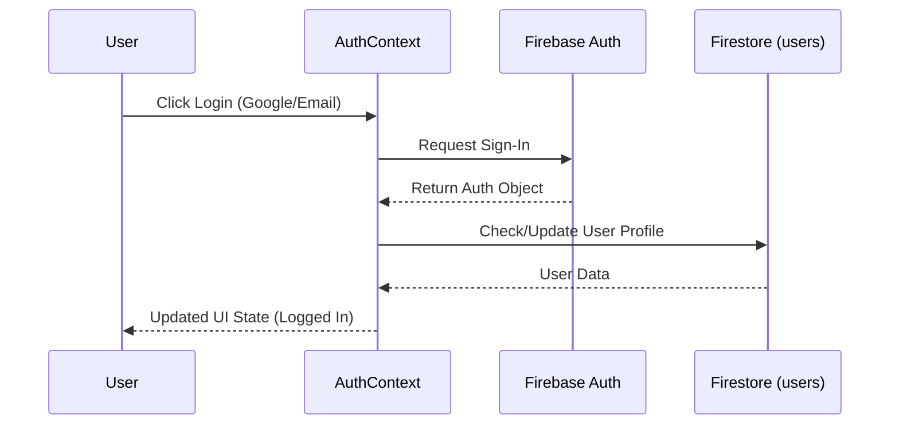
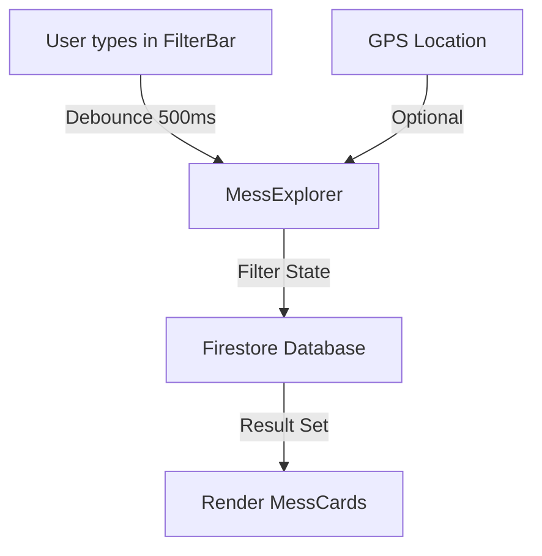

# MessKhojo - System Architecture

MessKhojo is a modern, full-stack web application designed to help students and professionals find and book mess (hostel/boarding) facilities. This document provides a detailed overview of the system's architecture, data models, and technical design.

## 🛠️ Technology Stack

### Core Frontend
- **React 19**: Leveraging concurrent rendering and improved performance.
- **Vite**: High-speed build tool and dev server.
- **React Router Dom (v7)**: Handles unified routing across web and potentially mobile.
- **Framer Motion**: Powering smooth UI transitions and micro-animations.
- **Tailwind CSS**: Utility-first CSS framework for responsive and themed styling.

### Backend & Infrastructure
- **Firebase Ecosystem**:
    - **Firestore**: NoSQL real-time document database.
    - **Cloud Storage**: Used for hosting mess images and user profiles.
    - **Firebase Authentication**: Supporting Email/Password and Google OAuth.
    - **Secondary Firebase Auth**: Specialized implementation for secure admin/operator management without disrupting user sessions.
- **Netlify**: CI/CD and production hosting environment.
- **Lucide React**: Icon library for a clean, consistent UI.

### Analytics & SEO
- **React GA4**: Integration for user behavior tracking.
- **SEO Hook**: Custom `usePageSEO` hook for dynamic meta tags management.

## 📂 Advanced Directory Structure

```text
mess-khojo/
├── client/                     # Primary Frontend Application
│   ├── src/
│   │   ├── components/         # Atomic UI components and feature-specific blocks
│   │   │   ├── MessExplorer.jsx# Core searching/filtering engine
│   │   │   ├── Header.jsx      # Navigation with Auth state awareness
│   │   │   └── MapPicker.jsx   # Google Maps integration for property location
│   │   ├── pages/              # Route-level view components
│   │   │   ├── Home.jsx        # Landing page with discovery features
│   │   │   ├── OperationalDashboard.jsx # Business logic for operators
│   │   │   └── MessDetails.jsx # Comprehensive property views
│   │   ├── context/            # React Context Providers
│   │   │   └── AuthContext.jsx # Global user state and Firebase Auth bridge
│   │   ├── hooks/              # Custom reusable logic (e.g., usePageSEO)
│   │   ├── utils/              # Helper functions (analytics, data formatting)
│   │   ├── firebase.js         # Firebase SDK initialization and service exports
│   │   └── App.jsx             # Application shell and route definitions
│   └── public/                 # Static assets and manifest files
├── firestore.rules             # Security definitions for data access
├── storage.rules               # Security definitions for media access
└── netlify.toml                # Deployment and redirect configurations
```

## 📊 Data Models (Firestore)

| Collection | Description | Access Control |
| :--- | :--- | :--- |
| `users` | User profiles and preferences | Owner (UID match) |
| `messes` | Property listings, amenities, locations | Public Read, Admin/Operator Write |
| `rooms` | Detailed room types and availability | Public Read, Admin Write |
| `bookings` | Transactional records of room bookings | User (Owner) & Operator |
| `mess_registrations` | Pending property verification requests | Public Create, Operator Read/Manage |
| `feedbacks` | User-submitted feedback and bug reports | Public Create, Operator Manage |
| `inquiries` | General platform inquiries | Public Create, Operator Manage |

## 🔄 Core Flows

### 1. Unified Authentication Flow


### 2. Search & Discovery Engine
The search system utilizes **debouncing** to optimize API calls to Firestore and Google Maps services.



## 🛡️ Security & Role-Based Access (RBAC)
We implement a three-tier access system:
1.  **Public**: Read-only access to messes, rooms, and SEO-relevant content.
2.  **User**: Access to personal profile and own bookings.
3.  **Operator**: Privileged access via a specific email (`messkhojooperator@gmail.com`) to manage all platform registrations and inquiries.

## 🚀 Performance Optimizations
- **Windowing**: Using `react-window` for large list rendering.
- **Image Compression**: `browser-image-compression` for frontend uploads.
- **Lazy Loading**: Automatic route-based code splitting.
- **Real-time Listeners**: Selective use of Firestore `onSnapshot` for critical live data.

---
*Last Updated: January 2026*
